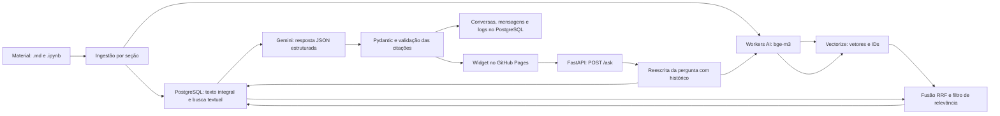

# Arquitetura do assistente RAG — Disruptive Architectures

## Objetivo

Construir o backend do chat do site do fork `KelsonZh0/DisruptiveArchitectures`. O assistente deve responder em português com base no material publicado, citar páginas que sustentam a resposta e informar quando o material não trouxer a informação pedida.

Esta é a **etapa 1** do projeto: decisões e desenho da solução. O código e os serviços ainda não foram implementados.

## Estado inicial do fork

- Site MkDocs Material em `material/`, com 77 arquivos Markdown e 28 notebooks encontrados na cópia local.
- Widget existente em `material/js/chat-widget.js`. Ele envia `POST {"pergunta": "..."}` e espera `{"resposta": "...", "fontes": [{"titulo": "...", "url": "..."}]}`; a URL atual aponta para o Worker do professor.
- Scripts existentes: `scripts/ingest.py`, `scripts/embed_with_workers_ai.py` e `scripts/build_vectorize_ndjson.py`.
- O workflow `.github/workflows/reindex-rag.yml` reage apenas a mudanças em `.md` e usa a URL do site do professor.
- Os dados gerados (`chunks.json`, `chunks_embedded.json`, `vectors.ndjson`) estão presentes no repositório.

## Diagrama



## Fluxo de ingestão

1. Ler Markdown e notebooks sem executar as células. Preservar texto, código e tabelas.
2. Separar o conteúdo por títulos H2/H3, mantendo blocos de código e tabelas inteiros. Formar trechos de cerca de 300–500 tokens, com sobreposição aproximada de 10%, e prefixar `Página > Seção`.
3. Gerar URL da página com âncora compatível com o MkDocs. Usar um ID determinístico derivado de caminho, seção e índice do trecho.
4. Salvar o texto completo e a referência no PostgreSQL. Gerar o embedding com `@cf/baai/bge-m3` e enviar ao Vectorize somente o vetor, ID e metadados leves.
5. Comparar IDs da versão anterior com a nova, remover vetores órfãos e ativar a nova versão após a sincronização. Escritas e exclusões no Vectorize são assíncronas; a rotina precisa aguardar ou verificar sua conclusão.

O ID é determinístico, mas inserir um trecho no começo de uma seção pode mudar o índice dos trechos seguintes. A comparação de versões resolve a remoção dos IDs antigos.

## Fluxo de pergunta e resposta

1. `POST /ask` recebe `pergunta` e, opcionalmente, histórico e identificação da conversa. A aplicação limita tamanho de entrada e número de trocas usadas.
2. Um serviço reescreve perguntas de acompanhamento usando o histórico: “E no ESP32?” vira uma pergunta autocontida, mantendo a intenção do aluno.
3. A pergunta reescrita é vetorizada com **o mesmo modelo de embeddings usado na ingestão**. O PostgreSQL executa, em paralelo, busca textual em português.
4. A aplicação combina as duas listas com Reciprocal Rank Fusion (RRF), recupera o texto integral no PostgreSQL e aplica um filtro de relevância calibrado com a avaliação. O valor do RRF ordena resultados; sozinho, não representa confiança factual.
5. O Gemini recebe somente os trechos selecionados e devolve JSON com `resposta`, `ids_trechos_usados` e `encontrou_no_material`.
6. Pydantic valida o formato. A aplicação aceita apenas IDs presentes no contexto e converte esses IDs em links. Se a evidência for insuficiente, informa que a resposta não foi encontrada no material.
7. A aplicação registra pergunta, resposta, IDs recuperados, posições/scores, latência, tokens disponíveis e erros no PostgreSQL.

O prompt de sistema terá papel, tarefa, contexto, formato de saída e restrições. Incluirá dois exemplos: resposta encontrada e informação ausente. Texto recuperado e perguntas adversariais serão tratados como dados, sem poder alterar as instruções do sistema.

## Contrato da API e segurança

| Rota | Uso |
| --- | --- |
| `POST /ask` | Mantém compatibilidade com o widget: aceita `pergunta` e retorna `resposta` e `fontes`. Histórico e conversa serão opcionais. |
| `GET /health` | Informa se o serviço está pronto para receber perguntas. |
| `GET /conversas/{id}` | Consulta uma conversa mediante token opaco associado a ela. Conhecer apenas o ID não deve expor mensagens. |

O backend restringirá CORS a `https://kelsonzh0.github.io`, aplicará limite de requisições por IP, validará entradas e não devolverá erros internos ao navegador. CORS limita o acesso pelo navegador, mas não substitui o limite de requisições para chamadas diretas à API. Segredos ficarão em variáveis de ambiente, nunca no JavaScript público nem em commits.

## Persistência

| Tabela | Finalidade |
| --- | --- |
| `chunks` | Texto completo, título, URL, origem, seção, ID estável, versão de ingestão e índice de busca textual. |
| `conversas` | Identificador, token de acesso protegido e datas de criação/atualização. |
| `mensagens` | Perguntas e respostas na ordem da conversa. |
| `interaction_logs` | Trechos recuperados, scores, latência, uso de tokens e erros. |
| `reindex_runs` | Acompanhamento das versões e da sincronização PostgreSQL/Vectorize. |

## Escolhas e alternativas

| Componente | Escolha | Justificativa e alternativa |
| --- | --- | --- |
| API | Python + FastAPI | Mantém a linguagem do curso e organiza rotas, serviços, repositórios e schemas. Um Worker exigiria implementar o backend principal em JavaScript/TypeScript. |
| Geração | `google-genai` + `gemini-3.5-flash`, por uma interface | Segue os laboratórios e permite trocar de provedor sem refazer o pipeline. O SDK suporta schemas Pydantic, mas o código ainda verificará evidência e IDs. |
| Embeddings | Workers AI `@cf/baai/bge-m3` | Reaproveita o índice existente; pergunta e documentos precisam estar no mesmo espaço vetorial. Trocar para `gemini-embedding-2` exigiria reindexar todos os documentos. |
| Busca | Vectorize + full-text search do PostgreSQL | Combina semântica com termos exatos. Usar apenas pgvector simplificaria o número de serviços, mas descartaria o pipeline Vectorize já fornecido. |
| Banco gerenciado | Supabase PostgreSQL | Guarda conteúdo, histórico e logs e oferece busca textual. Neon também oferece PostgreSQL; ambos exigem atenção à suspensão/ativação em planos gratuitos. |
| Deploy da API | Render | Caminho simples para publicar FastAPI. No plano gratuito, o serviço desliga após 15 minutos sem tráfego e o primeiro acesso pode demorar cerca de um minuto. O widget deverá informar que o serviço está iniciando e aguardar. Plano pago elimina essa limitação. |

## Estrutura proposta

```text
DisruptiveArchitectures/
├─ backend/
│  ├─ app/
│  │  ├─ api/              # rotas e dependências
│  │  ├─ services/         # RAG, LLM, embeddings e recuperação
│  │  ├─ repositories/     # PostgreSQL e Vectorize
│  │  ├─ schemas/          # contratos Pydantic
│  │  ├─ config.py         # configuração e segredos
│  │  └─ main.py
│  ├─ migrations/
│  ├─ tests/
│  └─ Dockerfile
├─ scripts/               # extração, embeddings e sincronização
├─ material/js/chat-widget.js
├─ eval/                  # perguntas e avaliação
├─ .github/workflows/
├─ compose.yaml
├─ .env.example
└─ README.md
```

## Como explicar esta parte na apresentação

“O PostgreSQL guarda o conteúdo integral e encontra termos exatos. O Vectorize encontra trechos semanticamente parecidos. A API une os resultados, entrega evidências ao Gemini e valida as citações antes de responder. O histórico e as métricas ficam persistidos para avaliação e auditoria.”

**Sugestão de commit:** `docs: define arquitetura do assistente RAG`

## Referências oficiais consultadas

- [Gemini 3.5 Flash](https://ai.google.dev/gemini-api/docs/models/gemini-3.5-flash.md)
- [Saídas estruturadas do Gemini](https://ai.google.dev/gemini-api/docs/structured-output)
- [Cloudflare Workers AI: bge-m3](https://developers.cloudflare.com/workers-ai/models/bge-m3/)
- [Cloudflare Vectorize API](https://developers.cloudflare.com/api/resources/vectorize/)
- [PostgreSQL: funções de busca textual](https://www.postgresql.org/docs/current/functions-textsearch.html)
- [Supabase: pausa de projetos gratuitos](https://supabase.com/docs/guides/platform/free-project-pausing)
- [Render: serviços gratuitos](https://render.com/docs/free)
